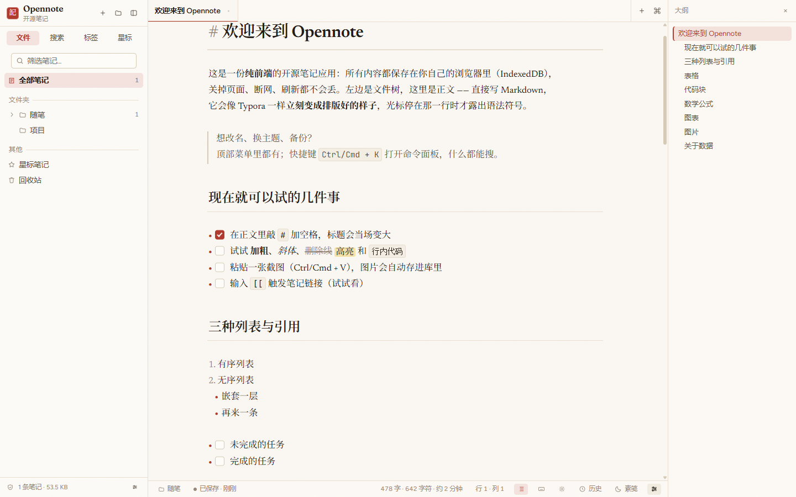
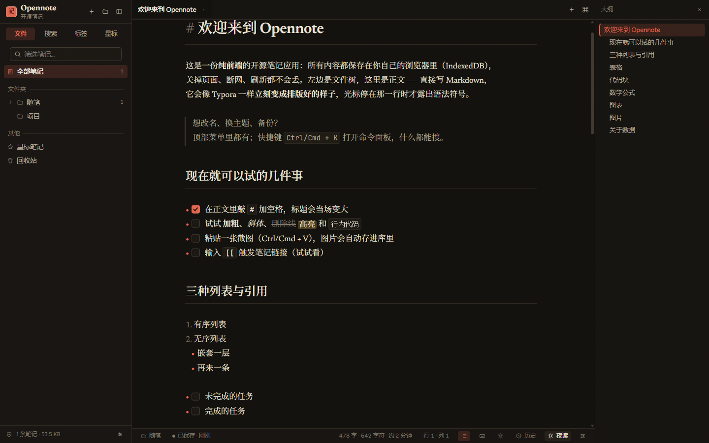
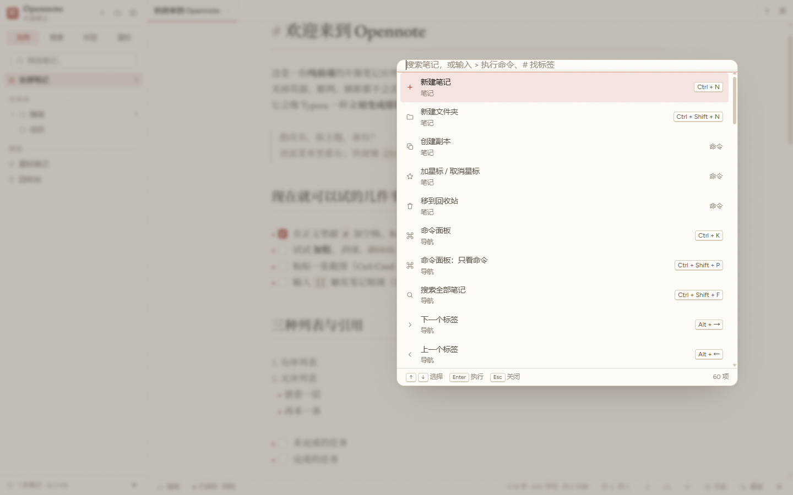
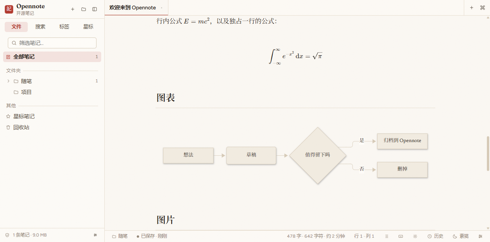
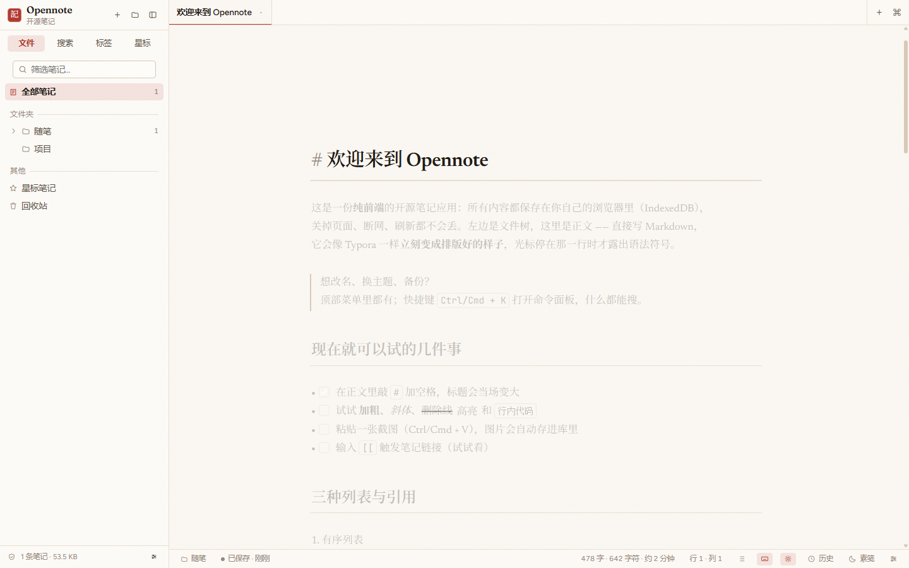

# Opennote · 开源笔记

纯前端、Typora 风格的 Markdown 笔记本。没有后端、没有账号、没有遥测，笔记只存在你自己的浏览器里。

[](LICENSE)


<!-- 截图：docs/screenshot.png（亮色 · 素笺）与 docs/screenshot-dark.png（暗色 · 夜读）由 `pnpm preview` 的真实构建抓取 -->




<details>
<summary>更多截图：命令面板 · 公式与图表 · 专注模式</summary>







</details>

## 特性

- **所见即所得的编辑**：语法标记（`#`、`**`、`[]()`、代码围栏、`$$`）在你没有编辑的那一行自动隐藏，光标回到该行时重新出现；图片、表格、公式、Mermaid 图表直接在正文里渲染，编辑与预览是同一个界面。
- **组织笔记**：文件夹树（支持拖拽移动与排序）、多标签编辑、文档大纲、模糊匹配的命令面板。
- **找得到东西**：全文搜索带命中片段与高亮；标签支持正文 `#tag` 或 YAML front-matter；还有收藏与回收站。
- **不怕写坏**：每篇笔记保留版本快照，可以回看并恢复；`[[wiki links]]` 在笔记之间互相跳转。
- **写作语法**：`==高亮==`、任务列表、图片粘贴与拖入（以 Blob 存进 IndexedDB，导出时改写为可移植的 `./assets/...` 路径）。
- **外观可调**：5 套主题 × 4 种强调色，4 种正文字体预设，字号 / 行高 / 栏宽可调；打字机模式、专注模式，以及打印为 PDF 的样式表。
- **数据进出自由**：导入导出 `.md`、`.zip` 备份、独立 `.html`；PWA 支持离线打开。

## 为什么是纯前端

笔记写进浏览器的 IndexedDB，整个过程不上传任何内容，服务器上根本没有你的笔记可丢。没有账号体系，也就没有注册、登录和「服务关停，请尽快导出」这类通知。数据的所有权是明确的：导出的 `.zip` 就是全部内容，可以放进 Git、塞进网盘，或者哪天不想用了直接换别的工具。

代价同样明确，需要你知道：笔记跟着这台设备的这个浏览器走。清理浏览器站点数据、卸载浏览器、或者使用无痕窗口，都可能让 IndexedDB 一起消失。所以请定期导出备份，换设备前先导出一次。

## 快速开始

需要 Node 22（与部署工作流保持一致）和 pnpm 9+。

```shell
pnpm install
pnpm dev        # 启动 Vite 开发服务器
pnpm build      # tsc --noEmit && vite build，静态产物在 dist/
pnpm preview    # 本地预览生产构建
pnpm typecheck  # 只做类型检查
pnpm test       # 运行 Vitest
```

`pnpm build` 的产物是纯静态文件，扔到任何静态托管上都能跑，不需要服务端。

## 质量与验证

- `pnpm typecheck`：TypeScript 严格模式全量类型检查（`strict` + `noUnusedLocals`）。
- `pnpm test`：95 个 Vitest 单元测试，覆盖 Markdown 扩展语法树（行内/块级公式、`==高亮==`、`[[wiki links]]`、GFM 表格与任务列表，以及它们在列表/引用等缩进上下文里的行为）、编辑器设置状态字段、模糊匹配、全文搜索排序、字数统计、文件命名与 zip 路径、备份清单解析。
- 编辑器内核的行为还有一层「真实浏览器」验证：实时预览装饰、KaTeX/Mermaid 渲染、图片粘贴入库、导出 zip 再导入的往返一致性，都是在 `pnpm preview` 的生产构建里实测过的。

## 数据与备份

- **存在哪里**：IndexedDB 数据库 `opennote`，包含 `notes`、`folders`、`assets`、`snapshots`、`meta` 五个 store；界面偏好（主题、字号、侧栏状态等）写在 localStorage 的 `opennote.ui.v1`。
- **备份**：导出 `.zip`，里面是 Markdown 正文、`assets/` 里的图片和一份元数据清单。
- **恢复**：导入同一份 `.zip` 即可还原笔记、文件夹与图片。
- **换电脑怎么办**：在新设备上用浏览器打开 Opennote，导入之前导出的 `.zip`；只想搬几篇笔记的话，导出 `.md` 再拖进去也一样。

建议养成定期导出的习惯，浏览器不会替你保存这些数据。

## 快捷键

macOS 用 ⌘，其他平台用 Ctrl。

| 动作 | 快捷键 |
| --- | --- |
| 命令面板 / 快速打开 | `Ctrl/⌘ + K`（别名 `Alt + K`） |
| 命令面板：只看命令 | `Ctrl/⌘ + Shift + P` |
| 全局搜索 | `Ctrl/⌘ + Shift + F` |
| 新建笔记 | `Ctrl/⌘ + N` |
| 新建文件夹 | `Ctrl/⌘ + Shift + N` |
| 立即保存 | `Ctrl/⌘ + S` |
| 关闭当前标签 | `Alt + W`（安装为应用后 `Ctrl/⌘ + W` 也可用） |
| 下一个 / 上一个标签 | `Alt + →` / `←`（别名 `Ctrl/⌘ + Alt + →/←`） |
| 加粗 / 斜体 | `Ctrl/⌘ + B` / `Ctrl/⌘ + I` |
| 行内代码 | `Ctrl/⌘ + E` |
| 插入链接 | `Ctrl/⌘ + Shift + K` |
| 删除线 / 高亮 | `Ctrl/⌘ + Shift + X` / `Ctrl/⌘ + Shift + H` |
| 标题 1–6 级 | `Ctrl/⌘ + 1` … `Ctrl/⌘ + 6` |
| 无序 / 有序 / 任务列表 | `Ctrl/⌘ + Shift + 8` / `7` / `9` |
| 引用 / 代码块 | `Ctrl/⌘ + Shift + Q` / `C` |
| 表格 / 公式块 / 图表 | `Ctrl/⌘ + Shift + T` / `M` / `G` |
| 折叠侧栏 / 大纲 | `Ctrl/⌘ + \` / `Ctrl/⌘ + Shift + O`（别名 `Alt + O`） |
| 切换亮/暗 | `Ctrl/⌘ + Alt + T`（别名 `Alt + T`） |
| 打字机模式 / 专注模式 | `Ctrl/⌘ + Shift + Y` / `D`（别名 `Alt + Y` / `Alt + D`） |
| 设置 / 快捷键说明 | `Ctrl/⌘ + ,` / `Ctrl/⌘ + /` |
| 打印或导出 PDF | `Ctrl/⌘ + P`（浏览器原生打印，已配好打印样式） |
| 编辑器内查找 / 替换 | `Ctrl/⌘ + F` / `Ctrl/⌘ + Alt + F` |

浏览器会占用一部分快捷键（`Ctrl + W`、`Ctrl + P`、`Ctrl + K` 等）。上表里的 `Alt` 别名在任何浏览器里都能用；把 Opennote「安装为应用」后，浏览器不再拦截这些组合键，全部绑定生效。

除了快捷键，侧栏顶部的 `⋯`（右键任意笔记或文件夹）以及右下角状态栏都能找到同样的命令；所有命令也在命令面板里（输入 `>` 前缀只看命令）。

## 主题

5 套主题：**素笺**（默认）、**青瓷**、**琥珀**、**夜读**、**砚池**；4 种强调色：**朱砂**、**靛青**、**松绿**、**藤黄**。`Ctrl/⌘ + Alt + T` 在亮色与暗色之间切换。

正文字体提供 4 种预设，另有「文楷」可选（按需从 jsDelivr 加载霞鹜文楷）。字号、行高、正文栏宽都可以在设置里调整。

## 导入导出格式

- **`.md`**：单篇笔记导出为普通 Markdown 文件，图片在正文中写成相对路径（`./assets/<资源 id>__<原文件名>`）；也可以选择把图片内联成 `data:` URL，导出一份单文件自包含的 Markdown。
- **`.zip`**：整库备份，结构与代码里的打包逻辑一一对应：

  ```
  opennote-backup-YYYYMMDD-HHmm.zip
  ├── opennote.json    元数据清单：笔记（id、正文、标签、创建/更新时间）、文件夹树、资源索引
  ├── README.txt       给未来自己的说明：这个包是什么、怎么恢复
  ├── notes/           每篇笔记一个 .md，按文件夹组织（未归档的放在 notes/未归档/）
  └── assets/          图片等二进制资源，文件名为 <资源 id>__<原文件名>
  ```

  导入时优先读 `opennote.json`（恢复笔记、文件夹、标签与图片）；如果压缩包里没有清单，则把其中所有 `.md` 当作笔记导入。
- **`.html`**：单篇笔记导出为独立的 HTML 文件，样式已内联、图片转成 `data:` URL，双击就能打开或直接分享。

导入以 `merge` 方式进行：所有内容都会分配新的 id，因此重复导入同一份备份不会覆盖现有笔记，而是追加一份副本。想整库还原，先清空再导入即可。

## 部署

### GitHub Pages

仓库自带 [`.github/workflows/deploy.yml`](.github/workflows/deploy.yml)：推送到 `main` 或手动触发 `workflow_dispatch` 时，用 Node 22 + pnpm 构建，并把 `dist/` 发布到 Pages。

启用方式：仓库 **Settings → Pages → Source** 选择 **GitHub Actions**，然后推一次 `main`。

工作流里用 `VITE_BASE=/${{ github.event.repository.name }}/` 指定子路径，构建时通过 `VITE_BASE` 环境变量注入 Vite 的 `base`（默认 `/`）。因此部署到任意子路径下都没问题；部署在域名根目录时不用设这个变量。

### Vercel / Netlify / Cloudflare Pages

都不需要额外配置：构建命令 `pnpm build`，输出目录 `dist`。默认 `base` 为 `/`，放在根目录即可。

## 技术栈与架构

- **构建**：Vite + React 19 + TypeScript
- **编辑器**：CodeMirror 6 作为编辑核心，`@lezer/markdown` 提供语法树，用于按行决定哪些语法标记要隐藏
- **渲染**：KaTeX 负责公式，Mermaid 负责图表，全部内联在编辑界面中
- **数据**：IndexedDB（`idb`）存笔记与图片，JSZip 负责备份打包
- **离线和安装**：`vite-plugin-pwa` 提供 Service Worker 与应用清单，首次访问后断网也能打开；图标与 `docs/` 下的截图同源（`scripts/make_icons.py` 生成）。
- **样式**：手写 CSS，设计令牌 + 主题；字体自托管（`@fontsource-variable`：Fraunces、Newsreader、Figtree、JetBrains Mono），「文楷」文档字体按需从 jsDelivr 加载

```
src/
├── data/        数据层：IndexedDB 封装、领域类型、图片资源、初始示例笔记、界面偏好
├── editor/      CodeMirror 6 编辑器：Markdown 扩展语法、实时预览装饰、公式与图表 widget、命令与补全
├── components/  React 界面：侧栏文件树、标签页、大纲、命令面板、设置/历史/快捷键面板、浮层
├── lib/         通用工具：状态存储、导入导出、模糊匹配、大纲提取、快捷键注册表
└── styles/      手写样式：设计令牌与主题、基础层、正文排版、编辑器与外壳
```

## 路线图

- 移动端布局优化（目前的交互主要面向桌面宽屏）。
- 可选的本地文件夹直连（File System Access API），让笔记直接落在磁盘上的真实目录里。
- 笔记加密（本地口令加密，密钥不出浏览器）。
- 原生排版的 PDF 导出（当前是打印样式表 + 浏览器打印）。
- 插件化的自定义主题。

## 参与贡献

1. Fork 本仓库并 clone 到本地。
2. `pnpm install` 安装依赖，`pnpm dev` 起开发服务器。
3. 提交信息遵循 [Conventional Commits](https://www.conventionalcommits.org/)，例如 `feat(editor): 行内渲染任务列表`、`fix(search): 修正片段高亮偏移`。
4. 提交 PR 前跑一遍 `pnpm typecheck && pnpm test`。

Issue 和 PR 都欢迎；如果是较大的改动，建议先开 issue 聊一下方向。

## 许可证

[MIT](LICENSE) © 2025 Opennote contributors

## English

Opennote is a pure-frontend, Typora-flavoured Markdown notebook for personal notes. There is no backend, no account and no telemetry: every note lives in your browser's IndexedDB and nothing is ever uploaded.

- **Seamless live preview**: syntax marks (`#`, `**`, `[]()`, code fences, `$$`) are hidden on the lines you are not editing and reappear under the cursor, while images, tables, formulas and Mermaid diagrams render inline in the same surface.
- **Organise**: folder tree with drag & drop, multi-tab editing, document outline, fuzzy command palette, full-text search with snippets and highlights, tags, starred notes, trash, per-note version snapshots and `[[wiki links]]`.
- **Write**: `==highlight==`, task lists, image paste/drag (stored as blobs in IndexedDB, rewritten to portable `./assets/...` paths on export).
- **Make it yours**: 5 themes × 4 accents, 4 document font presets, adjustable font size / line height / column width, typewriter mode, focus mode, print-to-PDF stylesheet.
- **Own your data**: import/export as `.md`, `.zip` backup and standalone `.html`; offline via PWA.
- **Verified**: `pnpm test` runs 95 unit tests over the markdown extensions, editor state, search ranking, word counting and backup paths; the live preview, KaTeX/Mermaid rendering, image paste and a zip export → import round trip were exercised against the production build in a real browser.

**Getting started** — requires Node 22 and pnpm 9+:

```shell
pnpm install
pnpm dev        # Vite dev server
pnpm build      # tsc --noEmit && vite build, static output in dist/
pnpm preview    # serve the production build locally
pnpm typecheck
pnpm test       # Vitest
```

**Storage** — IndexedDB database `opennote` (stores: `notes`, `folders`, `assets`, `snapshots`, `meta`) plus the localStorage key `opennote.ui.v1` for UI preferences. Export a `.zip` to back everything up, and import it on another machine to move your notes.

**Deployment** — the included GitHub Pages workflow builds on pushes to `main` and on `workflow_dispatch`. `VITE_BASE` (default `/`) exists so sub-path hosting works; Vercel, Netlify and Cloudflare Pages need no configuration (build `pnpm build`, output `dist`).

**Contributing** — fork, `pnpm install`, `pnpm dev`, use Conventional Commits, run `pnpm typecheck && pnpm test` before opening a PR. Licensed under [MIT](LICENSE).
