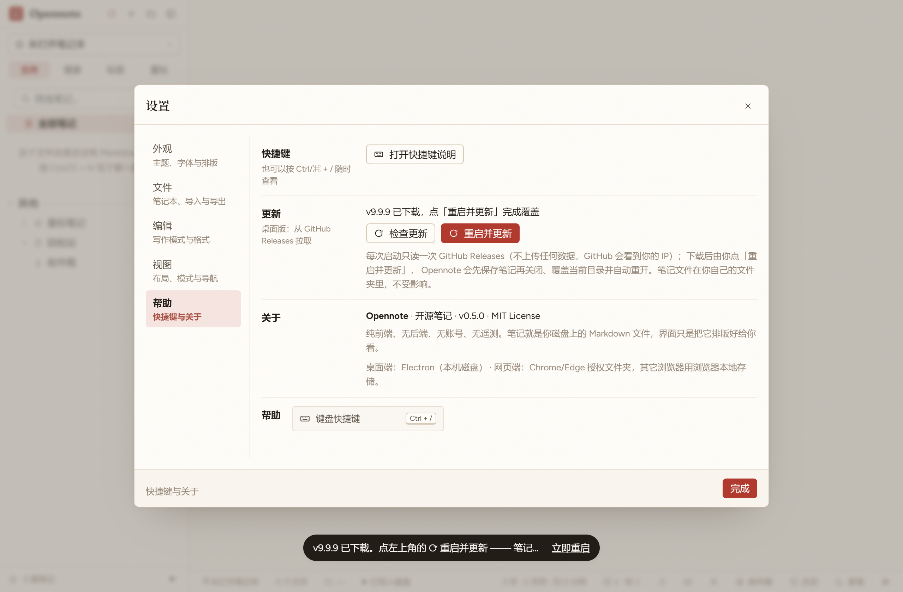

# 桌面版自更新：机制、契约与边界

> 面向维护者与验证者。用户可见的一句话在 [README](../README.md) 的「下载与分发」；
> 发布流程与发布日演练在 [RELEASING.md](../RELEASING.md) 第 7 节。
> 相关文件：[`electron/update.cjs`](../../electron/update.cjs)（状态机，唯一产地）、
> [`electron/zip.cjs`](../../electron/zip.cjs)（解压）、
> [`electron/update-helper.cjs`](../../electron/update-helper.cjs)（覆盖脚本）、
> [`src/lib/updateView.ts`](../../src/lib/updateView.ts)（图标与文案）、
> [`scripts/update-e2e.cjs`](../../scripts/update-e2e.cjs)（端到端）。

## 1. 用户看到什么

「每次启动检查一次」是产品决定（不是定时轮询）：窗口出来 5 秒后查一次 GitHub Releases，
设置 →「帮助」里另有一个手动「检查更新」。

| 状态 | 红框处的图标 | 颜色 | 点击 | 一句话 |
| --- | --- | --- | --- | --- |
| `idle`（已是最新） | **不显示**（不占位） | — | — | 没有更新就不打扰 |
| `checking` | 循环箭头 | 灰 `--ink-2` | 不可点 | 「正在检查更新…」 |
| `available` | 下载箭头 | **强调色 `--accent`** | 立即下载 | 「发现新版本 v0.6.0（当前 v0.5.0）· 点击下载 151.1 MB」 |
| `downloading` | 下载箭头 + 进度弧 | 强调色 | 取消 | 「正在下载 / 正在解压 v0.6.0 — 42%（点击取消）」 |
| `ready` | 循环箭头 | 强调色 | 确认后重启并更新 | 「v0.6.0 已下载 · 点击重启并更新」 |
| `error` | 下载箭头 | 强调色 | 重试 | 「更新失败：<原因> · 点击重试」 |

位置是 `.sidebar__actions` 的第一个子元素 —— 就是需求图里那个红框（品牌与「新建」之间）。
**颜色区分是需求的一部分**：旁边三个按钮是 `--ink-2`（灰），更新按钮是每个主题自己的强调色。

真机截图（`release/win-unpacked` 打包版 + 本地假 Release + CDP 驱动，
重新生成：`node scripts/update-shots.cjs` 或 `pnpm update:shots`）：

| 有更新（强调色下载图标） | 下载中（进度弧） | 已下载（重启图标） | 设置 →「帮助」里的「更新」行 |
| --- | --- | --- | --- |
|  |  |  |  |

`error` 有一条额外规则：**启动时那次静默检查失败不显示图标**（断网、限流不该每次开机弹一个红叉），
只有用户主动点过检查/下载之后才显示可重试的图标。这条判据在
[`src/lib/updateView.test.ts`](../../src/lib/updateView.test.ts) 里。

「重启并更新」的确认框在**渲染层**（应用内对话框，`askConfirm`）：这一步会关应用、覆盖安装目录，
值得再问一次；而主进程弹原生模态会挡住 e2e 与自动化。

## 2. 谁负责什么

```
渲染层（只显示状态、只转发动作）
  src/lib/update.ts          store + 订阅 + 把「点图标」翻译成一次 IPC
  src/lib/updateView.ts      六态 → 图标/颜色/可点行为/文案（唯一产地）
  src/components/Sidebar.tsx 红框处的按钮
  src/components/AppDialogs  设置 →「帮助」里的「更新」行
        │  5 个 invoke + 1 个订阅（没有「传 URL / 传路径 / 传版本」的入口）
        ▼
主进程（网络、磁盘、进程控制全在这里）
  electron/update.cjs        状态机：检查 / 下载 / 校验 / 解压 / 恢复 / 清理
  electron/zip.cjs           纯 Node 流式解压（CRC32、拒 ZIP64/加密/zip-slip）
  electron/update-helper.cjs 独立运行的覆盖脚本（等旧进程退出 → 复制 → 启动新版）
```

**网络只在主进程**，所以 CSP 的 `connect-src 'self' file:` **一个字节都不用改**。
这是本设计最重要的红线：`scripts/ipc-safety-check.cjs` 会断言渲染层没有 URL/路径入口。

## 3. IPC 契约（全部只追加）

| 频道 | 方向 | arity | 返回 |
| --- | --- | --- | --- |
| `opennote:update:status` | invoke | 0 | `UpdateStatus`（首次带 `applyResult`） |
| `opennote:update:check` | invoke | 1（`{force?}`） | `UpdateStatus` |
| `opennote:update:download` | invoke | 0 | `UpdateStatus` |
| `opennote:update:cancel` | invoke | 0 | `UpdateStatus` |
| `opennote:update:restart` | invoke | 0 | `{ok, reason?}`（`NOT_READY`/`CANCELLED`/`UNSUPPORTED`） |
| `opennote:update:changed` | main → renderer + preload `subscribe` | 1 | `UpdateStatus`（进度节流 ≤5 次/秒） |

`UpdateStatus` 的字段名以 [`src/desktop/bridge.ts`](../../src/desktop/bridge.ts) 的类型为准
（`supported / current / phase / latest / releaseUrl / asset / progress / error / canAutoInstall /
checkedAt / applyResult?`），错误码是
`NETWORK | RATE_LIMIT | NOT_FOUND | CHECKSUM_MISMATCH | DISK_FULL | READ_ONLY_INSTALL |
EXTRACT_FAILED | APPLY_FAILED | UNSUPPORTED`。

**启用硬门**：`app.isPackaged && process.platform === 'win32' && process.arch === 'x64'`。
其余情况 `supported:false`，界面不出现任何更新入口 —— 没有产物却显示图标就是撒谎。
唯一的可配置入口是两个**主进程**环境变量：`OPENNOTE_UPDATE_API_BASE`、
`OPENNOTE_UPDATE_DOWNLOAD_BASE`（本地 e2e 与将来的国内镜像用；渲染层无权设置）。

## 4. 覆盖与重启：为什么必须绕这一圈

Windows 上**正在运行的 `Opennote.exe` 锁着自己**，不能先覆盖它再启动它。所以：

```
restart() → 渲染层确认 → 主进程写 staging/.apply-update.cjs 与 handoff.json
          → spawn(staging/Opennote.exe, [helper], ELECTRON_RUN_AS_NODE=1)   ← 用「新版 exe」跑
          → mainWindow.close()（走既有 D11 落盘握手，最多等 1.5s）
          → app.quit()
helper    → 轮询旧 PID 退出（≤120s）→ 清上次的 *.old-* → 逐文件复制
          → 顺序：其它文件 → resources/app.asar → **Opennote.exe 最后**
          → spawn(install/Opennote.exe, 原 argv)（**删掉** ELECTRON_RUN_AS_NODE）
          → 写 userData/updates/result.json → 清 staging（除自身 exe）→ 退出
新版本    → 启动时读 result.json（一次性提示）→ 清掉 staging 与 zip
```

- **为什么 helper 用 staging 里的 exe**：`ELECTRON_RUN_AS_NODE` 下 asar 支持关闭，
  helper 必须是**真实文件**（运行时从 asar 复制过去）；而旧安装目录此刻没有任何进程，
  复制就是普通文件操作。实测：打包后的 exe 以 `ELECTRON_RUN_AS_NODE=1` 运行时是 Node v24.21.0。
- **为什么 exe 最后**：中途断电时磁盘上至少是「旧 exe + 新 asar」或「新 exe + 新 asar」，
  两种组合都能启动（整个应用在 asar 里）。**没有**做原子替换 —— 这是已知取舍。
- **为什么不用 cmd/robocopy/PowerShell**：中文路径要过代码页、`-ExecutionPolicy` 受策略影响，
  而 helper 只用 node 内建模块，零依赖、零编码坑。
- **失败矩阵**（每一条都有中文可执行文案，绝不静默）：

| 情况 | 状态 | 处置 |
| --- | --- | --- |
| 安装目录不可写（Program Files） | `READ_ONLY_INSTALL` | **下载前**就探测并拒绝，提示去 Releases 手动覆盖 |
| 磁盘不足 | `DISK_FULL` | 给出「需要约 X MB / 可用 Y MB」，不开始下载 |
| `SHA256SUMS` 缺行 / 校验不符 | `CHECKSUM_MISMATCH` | 删掉半截文件与 staging，绝不安装未校验的字节 |
| 下载 404 / 限流 / 断网 | `NOT_FOUND` / `RATE_LIMIT` / `NETWORK` | 限流自动降级解析 `releases/latest` 的 302（不耗 API 配额） |
| 解压失败（CRC、截断、越界） | `EXTRACT_FAILED` | 整目录删除，不留下「看起来成功」的残缺目录 |
| 覆盖途中断电/注销 | `APPLY_FAILED` | 下次启动读 `.applying` 标记如实报错，staging 保留可重试 |
| 上次下完没重启 | `ready` | 启动直接进待重启态，不白下 151 MB |

### 4.1 一个必须记住的坑：`process.noAsar`

Electron 的 fs 补丁把「**路径里含 `.asar`**」的写操作当成「在 asar 包里写文件」。
免安装包里恰好有 `resources/app.asar`，所以主进程解压它时会去 open 那个还不存在 / 正写到一半的
归档，抛 `Invalid package`（实测栈：`WriteStream._construct → Object.open → createError`）。
症状是**下载与校验都成功、解压必失败**，而界面只会说「更新失败，请稍后重试」。
修法是解压与清理 staging 期间 `process.noAsar = true`
（[`electron/zip.cjs`](../../electron/zip.cjs) 的 `withAsarDisabled`），覆盖脚本里也置一次作第二道保险。
这条是 0.6.0 端到端脚本第一次真跑抓出来的**真缺陷**，`src/desktop/zip.test.ts` 有断言咬住。

## 5. 完整性与真实性（如实说清边界）

- 期望摘要优先取**同一个 Release 的 `SHA256SUMS`**，缺失时退回 GitHub 的 asset digest；
  两个都没有 → **拒绝安装**（`CHECKSUM_MISMATCH`）。
- 下载是**流式**校验（边下边算 sha256），所以不需要把 151 MB 读进内存。
- **边界**：`SHA256SUMS` 与安装包来自**同一个源**，所以它保证的是「传输没坏 / 文件没被截断」，
  **不保证**「发布方没被投毒」。要防后者需要代码签名（现在没有），这也是为什么更新**必须由用户点击**、
  且每次更新后第一次运行仍会过一次 SmartScreen。
- **不做**断点续传（取消/失败即删 `.part`，不让 `userData` 长期占 550 MB）；
  将来要补就用 HTTP `Range`。

## 6. 安全不变式

1. 渲染层不能传 URL / 路径 / 版本 —— 只有第 3 节那六条通道；
2. 唯一可配置的是主进程环境变量（镜像与 e2e），渲染层碰不到；
3. 仓库身份只来自打包内 `package.json` 的 `repository.url`（**不是** `homepage`）；
4. 每个 handler 都做 `isTrustedSender` 来源校验（`ipc-safety-check.cjs` 有断言）；
5. 不做静默安装：必须有人点「重启并更新」；
6. 覆盖只动安装目录与 `userData/updates/**`，用户笔记本目录一个字节都不碰；
7. 校验不过 = 删包 + 明确报错；
8. 网络只在主进程，CSP 不动。

## 7. 测试地图

| 覆盖 | 在哪 |
| --- | --- |
| 版本比较 / 资产挑选 / `SHA256SUMS` 解析 | [`src/desktop/update.test.ts`](../../src/desktop/update.test.ts) |
| 仓库身份（`repository.url` 能解析 + 与 `homepage` 指向同一仓库） | [`src/desktop/repository.test.ts`](../../src/desktop/repository.test.ts) |
| 检查→下载→校验→解压→恢复的**真跑**（本地 http、真磁盘、302/404/限流/坏包/取消/只读目录） | [`src/desktop/updateServer.test.ts`](../../src/desktop/updateServer.test.ts) |
| 解压器正反两测（store/deflate、UTF-8 名、`..` 越界、CRC 坏、截断、ZIP64、加密、取消） | [`src/desktop/zip.test.ts`](../../src/desktop/zip.test.ts) |
| helper ↔ 主进程协议**逐字**一致 + 覆盖顺序 + 复制失败回滚 | [`src/desktop/updateProtocol.test.ts`](../../src/desktop/updateProtocol.test.ts) |
| 六态 → 图标/颜色/可点行为/文案 | [`src/lib/updateView.test.ts`](../../src/lib/updateView.test.ts) |
| 渲染层没有 URL/路径入口、来源校验、未打包时不动网络 | `node scripts/ipc-safety-check.cjs` |
| 两侧 IPC 通道配对、CSP 不放宽 | `node scripts/verify-contract.cjs` |
| 整条链路的**真覆盖**（临时安装目录 + 本地假 Release + CDP 驱动） | `node scripts/update-e2e.cjs` |

## 8. 明确没做（以及为什么）

- **剪藏扩展的自动更新**：没上架任何商店，`chrome://extensions` 的「加载已解压的扩展」
  没有更新通道；自托管 CRX 的 `update_url` 只在企业策略下生效。理由与将来路线写在
  [RELEASING.md](../RELEASING.md) 第 4 节。**这一轮不动扩展代码。**
- **网页版**：纯静态 + PWA，更新是 Service Worker 版本问题，与「覆盖安装」是两套。
- **静默更新 / electron-updater / NSIS**：先要有代码签名（[RELEASING.md](../RELEASING.md) 第 5 节）。
- **原子替换 / 回滚快照**：现在靠「exe 最后 + `.applying` 标记 + 如实报错」；回滚 = 下载旧 zip 覆盖。
- **后台定时检查**：只有「启动一次 + 手动」；要加定时器的话，得先想清楚与「无遥测」承诺的关系。
